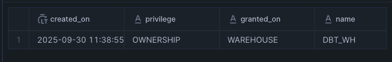
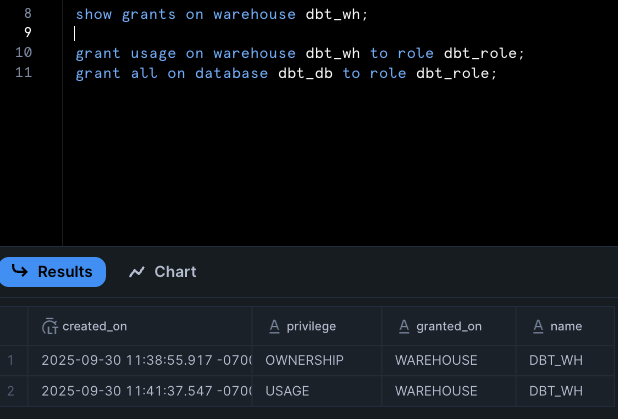
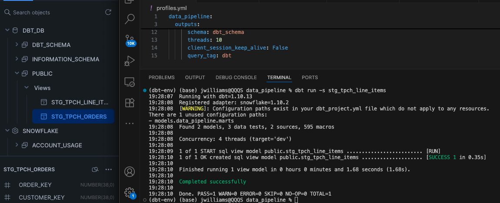
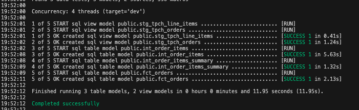
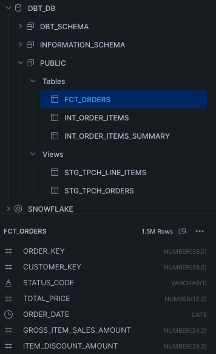
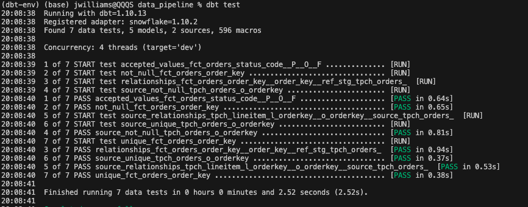
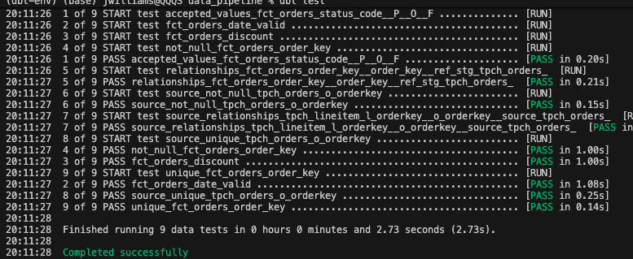

# DBT + Snowflake Data Pipeline

## Summary

A data pipeline orchestrating DBT transformations with  Airflow, designed for analytics with data ingestion via Snowflake.

## Architecture 


- **DBT (Data Build Tool)** for SQL-based data transformations and modeling 
- **Snowflake** as the cloud data warehouse platform
- **Astronomer Cosmos** for Airflow integration

The pipeline follows a medallion architecture with staging and mart layers, ensuring data quality through automated testing and maintaining separation between raw data ingestion and business logic implementation.

## Features

### Data Transformation Pipeline
- **Staging Layer**: Raw data ingestion and basic cleaning from the datasource
- **Marts Layer**: Business logic implementation with fact and dimension tables
- **Macros**: SQL functions for pricing calculations and data transformations

### Orchestration Capabilities
- **Daily Scheduling**: Automated pipeline execution with configurable intervals
- **Monitoring**: Comprehensive logging and alerting through Airflow UI

### Technical Implementation
- **Cloud Design**: Optimized for Snowflake data warehouse operations
- **Containerized Deployment**: Docker deployment with Astronomer Cosmos


## Step 1: Setup Snowflake enviroment

```sql
-- create accounts
USE ROLE accountadmin;

CREATE warehouse dbt_wh WITH warehouse_size='x-small';
CREATE database if not exists dbt_db;
CREATE role if not exists dbt_role;

show grants ON warehouse dbt_wh;

GRANT role dbt_role to user jazzyjeff;
GRANT usage ON warehouse dbt_wh to role dbt_role;
GRANT all ON database dbt_db to role dbt_role;

USE role dbt_role;

CREATE schema if not exists dbt_db.dbt_schema;

-- clean up
USE role accountadmin;

DROP warehouse if exists dbt_wh;
DROP database if exists dbt_db;
DROP role if exists dbt_role;
```


*Snowflake warehouse permissions and role configuration*

## Step 2: Configure dbt_profile.yaml

```yaml
models:
  snowflake_workshop:
    staging:
      materialized: view
      snowflake_warehouse: dbt_wh
    marts:
      materialized: table
      snowflake_warehouse: dbt_wh
```


## Step 3: Create source and staging files
### Create: models/staging/tpch_sources.yml
```yaml
version: 2

sources:
  - name: tpch
    database: snowflake_sample_data
    schema: tpch_sf1
    tables:
      - name: orders
        columns:
          - name: o_orderkey
            tests:
              - unique
              - not_null
      - name: lineitem
        columns:
          - name: l_orderkey
            tests:
              - relationships:
                  to: source('tpch', 'orders')
                  field: o_orderkey
```
### Create: models/staging/stg_tpch_orders.sql
```SQL
SELECT
    o_orderkey AS order_key,
    o_custkey AS customer_key,
    o_orderstatus AS status_code,
    o_totalprice AS total_price,
    o_orderdate AS order_date
FROM
    {{ source('tpch', 'orders') }}
```
### Create: models/staging/tpch/stg_tpch_line_items.sql
```sql
SELECT
    {{
        dbt_utils.generate_surrogate_key([
            'l_orderkey',
            'l_linenumber'
        ])
    }} AS order_item_key,
	l_orderkey AS order_key,
	l_partkey AS part_key,
	l_linenumber AS line_number,
	l_quantity AS quantity,
	l_extendedprice AS extended_price,
	l_discount AS discount_percentage,
	l_tax AS tax_rate
FROM
    {{ source('tpch', 'lineitem') }}
```
## Step 4: Macros
### Create: macros/pricing.sql
```sql

    (-1 * {{extended_price}} * {{discount_percentage}})::decimal(16, {{ scale }})

```


*dbt run*

## Step 5: Transform Models (Fact Tables, Data Marts)
### Create: models/marts/int_order_items.sql 
```sql
SELECT
    line_item.order_item_key,
    line_item.part_key,
    line_item.line_number,
    line_item.extended_price,
    orders.order_key,
    orders.customer_key,
    orders.order_date,
    {{ discounted_amount('line_item.extended_price', 'line_item.discount_percentage') }} AS item_discount_amount
FROM
    {{ ref('stg_tpch_orders') }} AS orders
JOIN
    {{ ref('stg_tpch_line_items') }} AS line_item
        ON orders.order_key = line_item.order_key
ORDER BY
    orders.order_date
```
### Create marts/int_order_items_summary.sql to aggregate info
```sql
SELECT 
    order_key,
    sum(extended_price) AS gross_item_sales_amount,
    sum(item_discount_amount) AS item_discount_amount
FROM
    {{ ref('int_order_items') }}
GROUP BY
    order_key
```

### Create Fact Table: models/marts/fct_orders.sql
```sql
SELECT
    orders.*,
    order_item_summary.gross_item_sales_amount,
    order_item_summary.item_discount_amount
FROM
    {{ref('stg_tpch_orders')}} AS orders
JOIN
    {{ref('int_order_items_summary')}} AS order_item_summary
        ON orders.order_key = order_item_summary.order_key
ORDER BY order_date
```


*dbt run showing fact tables and staging views successful run*

## Step 6: Tests
### Create: models/marts/tests.yml and tests/fct_orders_discount.sql
```yml
models:
  - name: fct_orders
    columns:
      - name: order_key
        tests:
          - unique
          - not_null
          - relationships:
              to: ref('stg_tpch_orders')
              field: order_key
              severity: warn
      - name: status_code
        tests:
          - accepted_values:
              values: ['P', 'O', 'F']
```
```sql
SELECT
    *
FROM
    {{ref('fct_orders')}}
WHERE
    item_discount_amount > 0
```
### Create: tests/fct_orders_date_valid.sql
```sql
SELECT
    *
FROM
    {{ref('fct_orders')}}
WHERE
    DATE(order_date) > CURRENT_DATE()
    OR DATE(order_date) < DATE('1990-01-01')
```






## Step 7: Deploy
### Update Dockerfile to deploy on Airflow
```dockerfile
RUN python -m venv dbt_venv && source dbt_venv/bin/activate && \
    pip install --no-cache-dir dbt-snowflake && deactivate
```
### requirements.txt
```
astronomer-cosmos
apache-airflow-providers-snowflake
```


